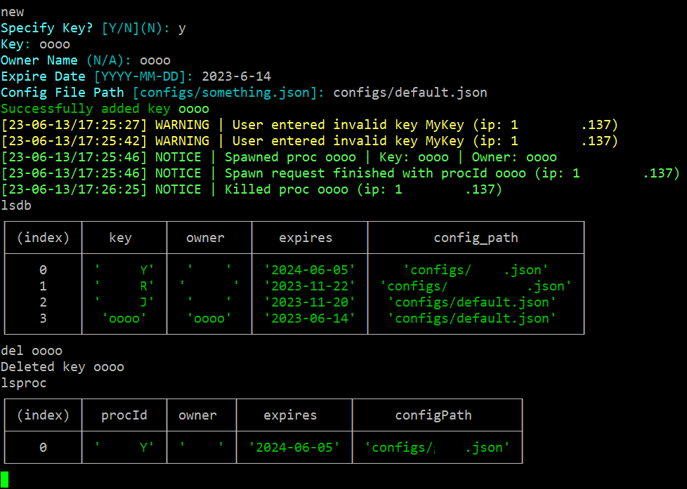
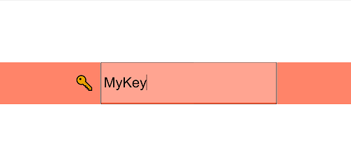
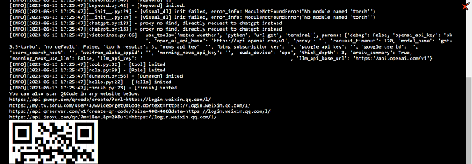
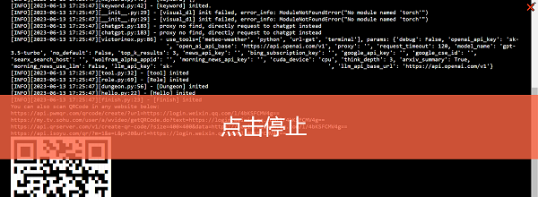

# BotPanel
WebUI for chatgpt-on-wechat [personal fork](https://github.com/TMBMode/chatgpt-on-wechat)

## What
ChatGPT on Wechat WebUI
- Supports multiple instantaneous sessions via child processes
- Key-based user management system
- Keys have expire dates to kill respective processes on time

## Images
> sensitive information erased
- Admin Console

- Login

- User Console

- Stop


## Deploy
Ensure Python ~3.8+ & NodeJS ~v16+ is installed (actual min support versions aren't tested)
```shell
cd ~
git clone https://github.com/TMBMode/chatgpt-on-wechat.git
git clone https://github.com/TMBMode/BotPanel.git
cd chatgpt-on-wechat && pip install -r requirements.txt
cd .. && mv BotPanel botpanel
cd botpanel && npm i
# prepare your config files for the bot under ~/chatgpt-on-wechat/configs/ #
# set your environment variables (see table below) #
node index.mjs
```
For long-term runs, use `screen` before `node index.mjs` and use `ctrl-a-d` to detach before disconnecting SSH
 
## Environment Variables
| Variable     | Value   | Desc   
| --------     | -----   | ---- 
| BOT_PATH      | string  | The `cwd` directory of the **bot**, e.g. `/home/ubuntu/chatgpt-on-wechat`
| PORT         | int     | The port to run on, defaults to `14514`
| OUTPUT_LIMIT | int     | Limits how much text can be stored for a single session
| DB_PATH      | string  | Specify the path of the database used to store keys

## Management
| Command     | Usage   
| -------     | ----- 
| new/add     | Add a new key (that binds to a process)
| del \[key\] | Delete the given key
| lsdb        | List information in the database
| lsproc      | List running (alive) processes
| kill \[id\] | Kill the process with the given id
| exit/stop   | Quit the program (equals ^C twice)
| mem         | Get system memory usage

## Note
- This is a sloppy project, so I bet you won't even take the time to read this line.
- If you do, hello!
- `key` isn't necessarily equivalent to `procId`, as the project started with numerical ID's with autoincrement cnt. Potential guest processes are allowed
